## 1.简单的文件路径遍历
1. 最理想的状态下，应用一点关于目录遍历的防护措施都没有，直接进行遍历即可，攻击者只需要对文件存放的实际位置进行猜测验证即可，拿到正确路径就可以读文件。

2. 右击随意一张图片，复制图片地址，粘贴至 HackBar 的 URL 中。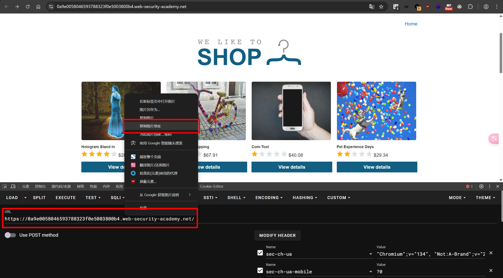

3. 修改 `filename` 的值为 `../../../etc.passwd`，访问指定文件路径。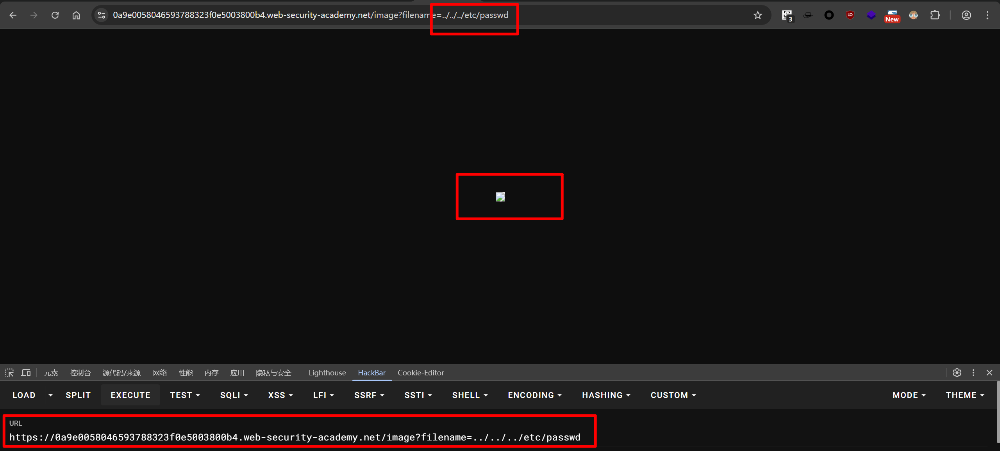

## 2.通过绝对路径绕过被阻止的路径遍历
1. 同上，复制图片地址，粘贴至 HackBar 的 URL 中。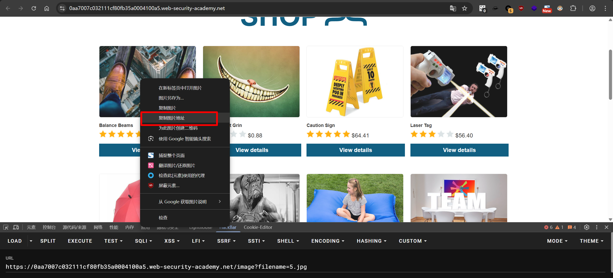

2. 修改参数，这次题目从用户提供的文件名中剥离或阻止目录遍历序列，我们使用绝对路径 `/etc/passwd` 绕过。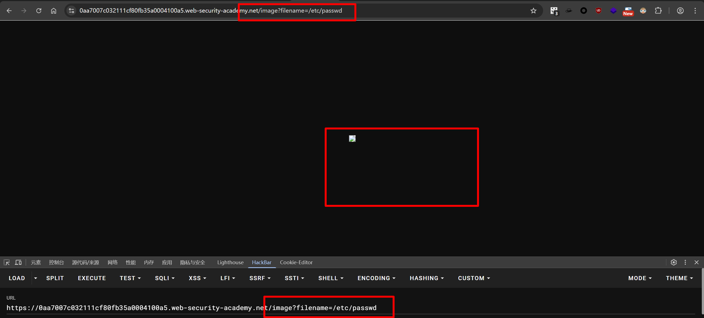

## 3.非递归遍历序列
1. 同上，复制图片地址，粘贴至 HackBar 的 URL 中。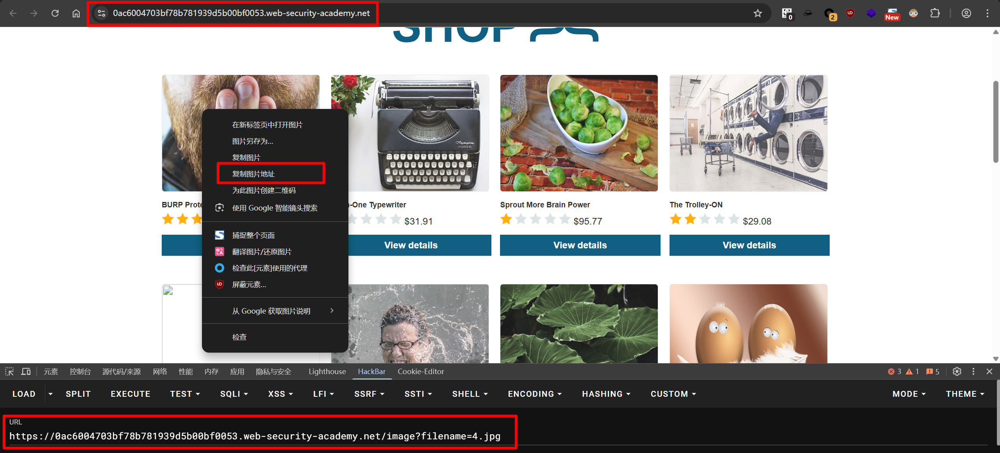

2. 本题进行了对用户的输入进行非递归的目录遍历序列过滤，这种情况下，对目录遍历序列进行重写（`....//`）即可绕过。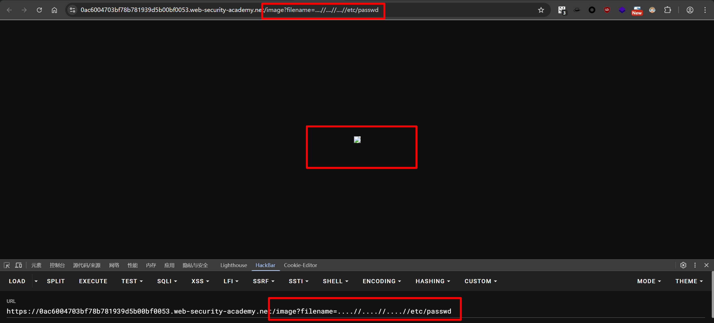

## 4.通过 URL 解码绕过遍历序列
1. 同上，复制图片地址，粘贴至 HackBar 的 URL 中。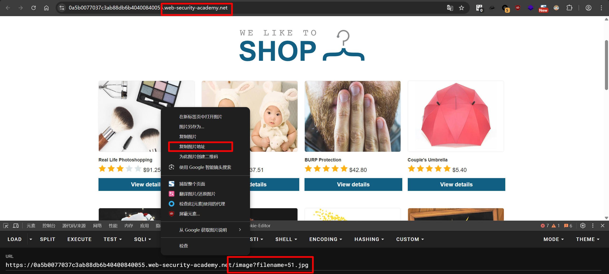

2. 本题服务器将路径遍历序列过滤后再将输入传递给文件系统，对输入的文件路径进行 URL 编码即可绕过此过滤。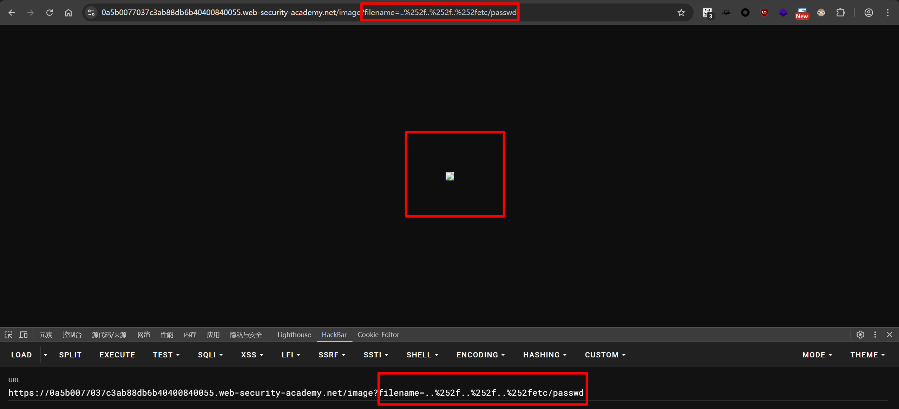

## 5.验证路径起点
1. 同上，复制图片地址，粘贴至 HackBar 的 URL 中。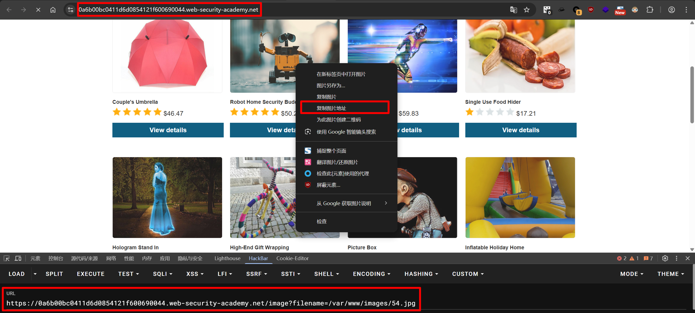

2. 本题要求用户提供的文件名必须包含预期的 base 目录，于是构造含有预期 base 目录的文件路径（`/var/www/images/../../../etc/passwd`）来进行文件读取。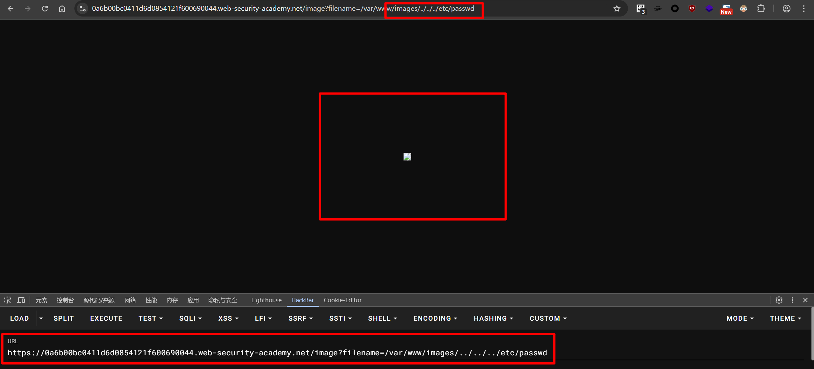

## 6.通过空字节绕过验证文件扩展名
1. 同上，复制图片地址，粘贴至 HackBar 的 URL 中。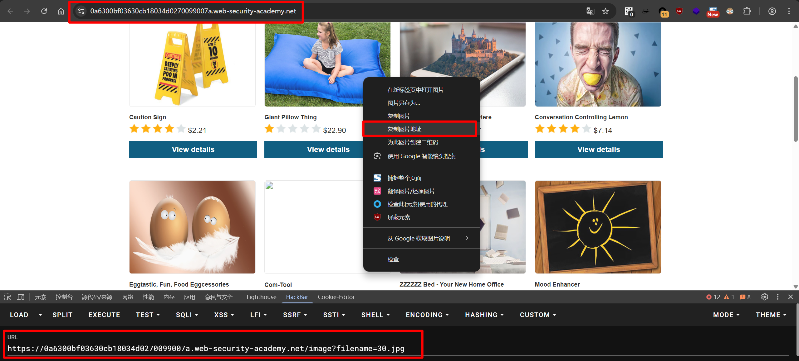

2. 本题要求用户提供的文件名以特定的后缀结尾，于是构造以特定后缀结尾的文件路径，并使用 `%00` 进行截断，防止特定文件后缀对路径遍历造成影响。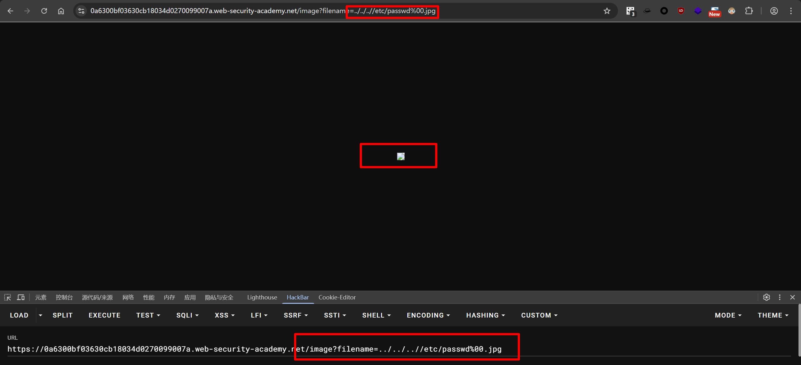
